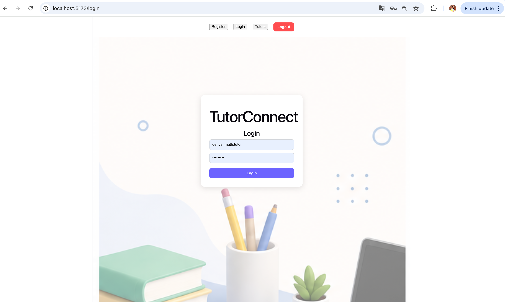
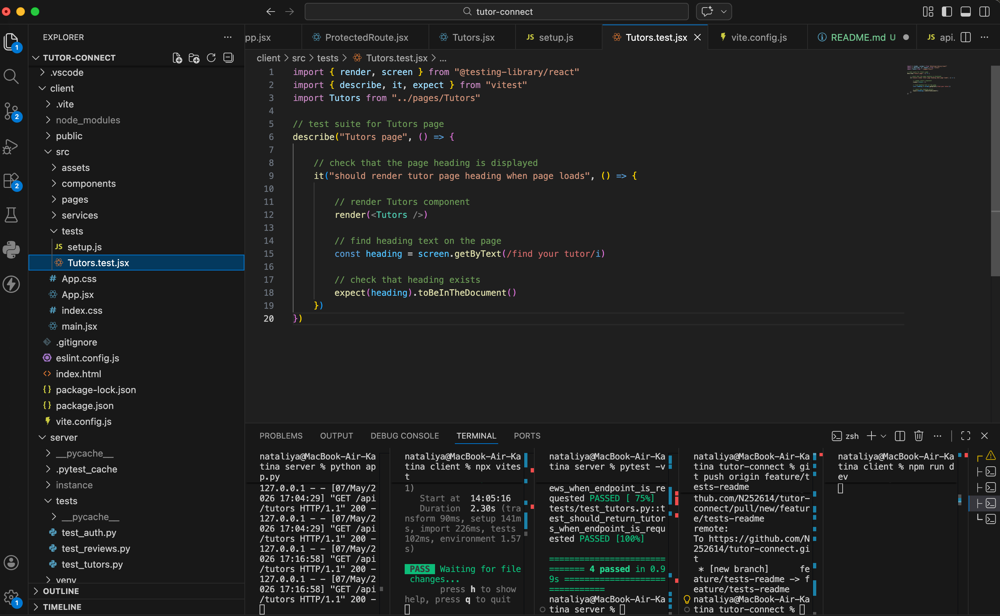

# TutorConnect

TutorConnect is a full-stack web application that helps students find tutors and allows tutors to create profiles, manage reviews, and connect with students.

The project includes user authentication, tutor profile creation, tutor search functionality, protected routes, frontend testing with Vitest, and backend API testing with Pytest.

---

## Project Features

### Authentication
- User registration
- User login
- JWT authentication
- Protected routes
- Student and tutor roles

### Tutor Features
- Create tutor profiles
- View tutor cards
- Manage tutor profile information
- Search tutors by subject
- Delete tutor profiles

### Student Features
- Browse tutors
- Search tutors
- View tutor reviews
- Add reviews
- Backend booking API endpoints

### Testing
- Frontend testing with Vitest and React Testing Library
- Backend API testing with Pytest
- Mocked frontend tests
- API endpoint testing

---


## Technologies Used

### Frontend
- React
- Vite
- React Router
- JavaScript (ES6)
- CSS

### Backend
- Flask
- Flask-JWT-Extended
- Flask-CORS
- SQLAlchemy
- SQLite

### Testing
- Vitest
- React Testing Library
- Pytest

---

## Project Structure
```plaintext
tutor-connect/
│
├── client/
│   ├── public/
│   ├── src/
│   │   ├── assets/
│   │   ├── components/
│   │   ├── pages/
│   │   ├── services/
│   │   ├── tests/
│   │   ├── App.jsx
│   │   ├── main.jsx
│   │   └── index.css
│   │
│   ├── package.json
│   ├── vite.config.js
│   └── index.html
│
├── server/
│   ├── instance/
│   ├── tests/
│   ├── app.py
│   ├── auth.py
│   ├── config.py
│   ├── models.py
│   ├── requirements.txt
│   └── routes.py
│
├── screenshots/
│
├── .gitignore
└── README.md
```

---

## Installation
### Clone the repository
```bash
git clone https://github.com/N252614/tutor-connect.git
```
### Navigate into the project folder
```bash
cd tutor-connect
```

---

## Backend Setup
### Navigate to the server folder
```bash
cd server
```
### Create virtual environment
```bash
python -m venv venv
```
### Activate virtual environment (Mac/Linux)
```bash
source venv/bin/activate
```
### Install backend dependencies
```bash
pip install -r requirements.txt
```
### Run the Flask server
```bash
python app.py
```
### Backend runs on: 
```bash
http://127.0.0.1:5000
```

---

## Frontend Setup
### Navigate to the client folder
```bash
cd client
```
### Install frontend dependencies
```bash
npm install
```
### Start the React development server
```bash
npm run dev
```
### Frontend runs on:
```bash
http://localhost:5173
```

---

## Running Tests
### Backend tests
Navigate to the server folder:
```bash
cd server
```
Run Pytest:
```bash
pytest -v
```
### Frontend tests
Navigate to the client folder:
```bash
cd client
```
Run Vitest:
```bash
npx vitest
```

---

## Screenshots 

### Register Page


### Login Page



### Tutor View


### Student View


### Search Functionality


### Testing



---

## API Endpoints

### Authentication
- POST /auth/register
- POST /auth/login
- GET /auth/me

### Tutor Profiles
- GET /api/tutors
- POST /api/tutor-profile
- PATCH /api/tutor-profile/<id>
- DELETE /api/tutor-profile/<id>

### Reviews
- POST /api/reviews

### Bookings
- GET /api/bookings
- POST /api/bookings
- PATCH /api/bookings/<id>
- DELETE /api/bookings/<id>

---

## Current Limitations

- Booking endpoints are implemented on the backend, but the frontend booking interface is not finished yet.
- The backend supports PATCH requests for profiles, reviews, and bookings, but the frontend edit interface is not fully implemented yet.

---

## Future Improvements
- Deployment with Render
- Profile image uploads
- Complete frontend booking interface for students
- Messaging between students and tutors
- Better mobile responsiveness
- Pagination for tutor search

---

## Author 

Nataliia Katina